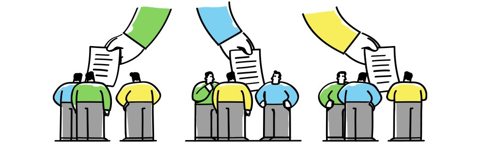
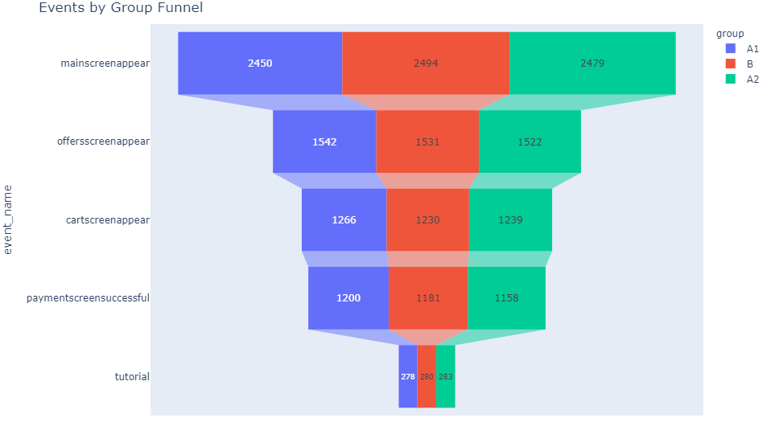

# A/A/B Test to Inform Business Decisions

    

## [Detailed Project Link](https://nbviewer.org/github/Emmanuel-Nti/aab_testing/blob/master/AAB_testing.ipynb)

## How I Approached the Project
- Importation of the data and libraries
- Preprocessed the data and carried out exploratory data analysis 
- Studied the event funnel (the user journey)
- Formulated and tested statistical hypotheses about the test results
- Conclusion and recommendation

## User Distribution by Group
All groups were present at all times for the test.
 

   
 

 
## User Behaviour
The funnel show stages of customers behaviour on the app. The group sizes at each stage indicate the data was splitted approximately equal.

   
 

 
## General Findings
- In preparing the data for analysis, missing values were checked, about 0.17% of duplicates were found in the data and deleted. 
- I ensured no participant belong to more than one group, and columns were converted to required data types.
- There were 7551 unique users in the logs, 5 types of events, and 243713 events in the logs.
- The data spanned a period of about two weeks. The minimum date was 2019-07-25 00:00:00, and the maximum date was 2019-08-07 00:00:00.
- The data was comparatively incomplete from 2019-07-25 to 2019-07-31. From 2019-08-01, the data was comparative complete. Hence, I chose to keep data from the period 2019-08-01 and ignored the earlier section, i.e. from 2019-07-25 to 2019-07-31.
- The event funnel was studied. Users initially visit the main screen, followed by an offer screen, then a cart screen is offered, and a payment is made. At the last stage, an optional tutorial is offered. Ignoring this order, and following the order based on how the data is sorted by the number of users and its' importance; the stage at with more users are lost, is from main screen stage to offer screen (about 38%).
- The share of users that make the entire journey from their first event to payment is about 47% (high conversion rate). This can be boosted by:
  - Conducting an A/B test for each event to reveal the stage of event where conversion of the service can significantly be enhanced.
  - Using a conversion rate optimization (CRO) planner, shortening forms, increasing trust and removing friction, and etc. For instance, conversion rate at the tutorial stage is not encouraging and should be considered for removal as it is contributing to a lower conversion.
- There is no statistically significant difference between groups A1 and A2 which implies the groups were splitted properly.
- There is also no statistically significant difference between groups A and B which implies the test was not successful.

## Recommendation
-  Stop the test, there is no difference between the groups. Hence, do not change the fonts for the entire app.

## Libraries Used
- Pandas 
- Numpy 
- matplotlib
- Plotly 
- Seaborn
- Scipy
- Datetime  

